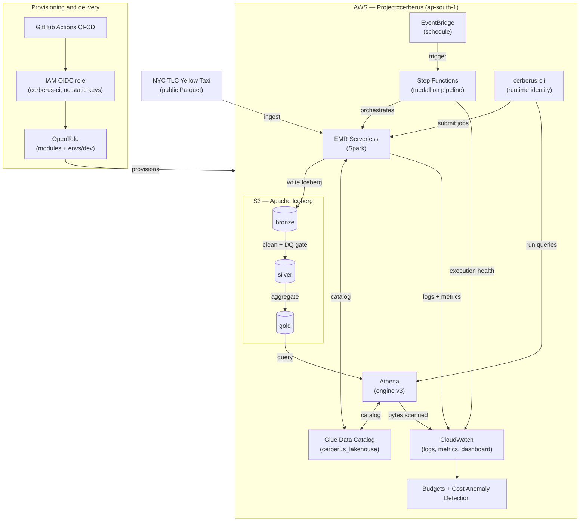

# Cerberus

**A serverless data lakehouse on AWS, built as a platform-engineering lab.**

Cerberus is a solo, resume-grade project that builds an Apache Iceberg medallion lakehouse on
AWS — provisioned, deployed, governed, and observed the way a real production AWS environment
is. The data pipeline (NYC TLC Yellow Taxi → bronze → silver → gold) is the *workload*; the
point is the *platform* around it: layered infrastructure-as-code, OIDC-federated CI/CD,
policy-as-code guardrails, serverless orchestration, data-quality gates, and cost governance.

> **Region:** `ap-south-1` (Mumbai)  ·  **IaC:** OpenTofu  ·  **Compute:** EMR Serverless +
> Athena  ·  **Orchestration:** Step Functions  ·  **Budget ceiling:** ~$15/month

---

## Project status

**Architecture phase complete. Implementation beginning.**

This repository currently documents a fully-reasoned architecture across **19 Architecture
Decision Records** — including the superseded designs that show how the platform got to its
current shape. The decision trail is the deliverable so far; the first infrastructure code
lands in Week 1 of the [roadmap](roadmap.md).

| Area | State |
|------|-------|
| Architecture & decision trail (ADR 001–019) | ✅ Complete |
| Roadmap, platform plan, diagrams | ✅ Complete |
| Week-1 implementation plan | ✅ Complete ([`docs/plan/week-01`](docs/plan/week-01)) |
| OpenTofu infrastructure code (`infra/`) | 🔜 Week 1 |
| Data pipeline (`pipelines/`) | 🔜 Phase 2+ |

What this means: this README describes the platform as designed. Sections marked 🔜 are not
yet deployed. The honesty is deliberate — see [ADR 011](docs/adr/011-full-iac-ownership-and-bootstrap-boundary.md)
on representing only what actually exists.

---

## Architecture

How provisioning, the data plane, orchestration, and observability fit together. Two more
views (IaC layering and CI/CD + orchestration flow) live in [`docs/architecture.md`](docs/architecture.md).



---

## Why this is interesting

Most portfolio data projects show a working pipeline. Cerberus shows the *engineering
judgment* behind one — including the decisions that were made, reversed, and superseded with
documented reasoning. The platform was not designed correct on the first try; it was reasoned
into its current shape, and that reasoning is preserved.

**The origin story, in three decisions:**

1. **[ADR 001](docs/adr/001-initial-platform-oss-on-ec2.md) — Start full-OSS on one EC2 box.**
   Spark + Airflow + Trino + Superset + Prometheus/Grafana via Docker Compose. Maximum
   learning visibility, one SSH target, stop-between-sessions billing.
2. **[ADR 004](docs/adr/004-compute-bottleneck-discovered.md) — The box doesn't fit.** A real
   per-service RAM budget reached 14–18 GB against t3.xlarge's 16 GB. The "use Compose
   profiles" mitigation fails the moment you run an *integrated* pipeline (all four profiles
   at once). The honest fix — t3.2xlarge — doubles cost and breaks the budget case.
3. **[ADR 005](docs/adr/005-pivot-to-serverless-compute.md) — Pivot to serverless.** The
   question flipped from "how do we fit OSS services on one box" to "do we need the box at
   all if the goal is learning, not operating a cluster." EMR Serverless + Athena: **$0 when
   idle**, pay-per-job-second.

Then the platform was hardened into a Cloud Lab — multi-environment IaC, keyless CI/CD,
orchestration, data quality, and cost governance (ADRs 013–019).

---

## Tech stack

| Layer | Choice | Rationale |
|-------|--------|-----------|
| Storage | **S3 + Apache Iceberg** | Open table format; bronze/silver/gold medallion ([ADR 002](docs/adr/002-storage-s3-iceberg.md)) |
| Catalog | **AWS Glue Data Catalog** | One catalog shared by EMR Serverless and Athena |
| Compute | **EMR Serverless (Spark)** | No idle cost; pay-per-job-second ([ADR 005](docs/adr/005-pivot-to-serverless-compute.md)) |
| Query | **Amazon Athena (v3)** | Serverless SQL over Iceberg; per-query billing ([ADR 006](docs/adr/006-query-engine-athena.md)) |
| Orchestration | **Step Functions + EventBridge** | Serverless, no idle cost ([ADR 017](docs/adr/017-step-functions-orchestration.md)) |
| Data quality | **PyDeequ** | Spark-native gates between medallion layers ([ADR 018](docs/adr/018-data-quality-pydeequ.md)) |
| IaC | **OpenTofu** | MPL-licensed; layered, multi-env ([ADR 011](docs/adr/011-full-iac-ownership-and-bootstrap-boundary.md)/[012](docs/adr/012-layered-remote-state.md)/[013](docs/adr/013-multi-environment-layout.md)) |
| CI/CD | **GitHub Actions** | Plan-on-PR, apply-on-merge ([ADR 015](docs/adr/015-github-actions-cicd.md)) |
| Identity | **OIDC federation** | Zero static keys; short-lived tokens ([ADR 014](docs/adr/014-oidc-federation-ci-provisioning.md)) |
| Policy | **OPA/conftest + trivy + tflint** | Security & tagging invariants as code ([ADR 016](docs/adr/016-policy-as-code-iac-testing.md)) |
| Observability | **CloudWatch** | Native metrics/logs; free at this scale ([ADR 007](docs/adr/007-observability-cloudwatch.md)) |
| Cost | **Budgets + Cost Anomaly Detection** | Layered detective + preventive controls ([ADR 019](docs/adr/019-cost-governance.md)) |
| Dataset | **NYC TLC Yellow Taxi** | Already-Parquet, partitioned, rich silver cleaning |

---

## Identity & security model

Two identities, strictly separated — the deploy-vs-runtime pattern, with the OIDC end-state
realized ([ADR 010](docs/adr/010-provisioning-runtime-identity-separation.md)/[014](docs/adr/014-oidc-federation-ci-provisioning.md)):

- **Provisioning** — GitHub Actions assumes `cerberus-ci-plan` (read-only, on PRs) or
  `cerberus-ci-apply` (write, on `main`) via **OIDC short-lived tokens**. No static admin
  keys exist anywhere. The trust-policy `sub` condition is the security boundary.
- **Runtime** — `cerberus-cli` (AWS CLI profile `cerberus`) operates the platform — submits
  jobs, runs queries, reads logs — but **cannot create, modify, or destroy infrastructure,
  create IAM, or touch the unrelated NovaPay project** ([ADR 003](docs/adr/003-iam-boundary.md)).

The single manual bootstrap step (the OIDC provider + CI roles + state bucket) is the one
documented exception to full IaC ownership — the [bootstrap paradox](docs/adr/011-full-iac-ownership-and-bootstrap-boundary.md):
OpenTofu cannot create the credential that runs OpenTofu.

---

## Repository layout

```
infra/
  bootstrap/                 # the one manual step: OIDC provider + CI role + state bucket
  modules/                   # reusable, tofu-tested modules (s3-bucket, iam-role, …)
  envs/
    dev/   00-foundation/ 10-iam/ 20-compute/ 30-orchestration/
    prod/  (structure ready, applied later)
.github/workflows/           # plan.yml (PR) · apply.yml (merge)
policy/                      # OPA/conftest rules
pipelines/                   # bronze/ silver/ gold/  (PySpark + PyDeequ)
sql/                         # Athena saved queries
observability/               # dashboard + alarms JSON
docs/
  adr/                       # 19 Architecture Decision Records
  plan/                      # weekly execution plans
  architecture.md            # three Mermaid diagrams
  cost-model.md              # credit budget + per-service estimates
roadmap.md · platform-plan.md
```

Stacks are applied in dependency order — `00-foundation → 10-iam → 20-compute →
30-orchestration` — and communicate only through SSM parameters, never another stack's state
file ([ADR 012](docs/adr/012-layered-remote-state.md)).

---

## The decision trail (ADRs 001–019)

The heart of this project. Each ADR records a real decision, the alternatives rejected, and
the honest trade-offs — including superseded designs.

| # | Decision | Status |
|---|----------|--------|
| [001](docs/adr/001-initial-platform-oss-on-ec2.md) | Full OSS stack on EC2 via Docker Compose | Superseded by 005/006/007 |
| [002](docs/adr/002-storage-s3-iceberg.md) | Storage: S3 + Apache Iceberg | Accepted |
| [003](docs/adr/003-iam-boundary.md) | IAM boundary: scoped `cerberus-cli`, hard NovaPay separation | Amended by 008 |
| [004](docs/adr/004-compute-bottleneck-discovered.md) | Compute bottleneck: t3.xlarge RAM insufficient | Closed (evidence) |
| [005](docs/adr/005-pivot-to-serverless-compute.md) | Pivot to serverless compute (EMR Serverless) | Accepted |
| [006](docs/adr/006-query-engine-athena.md) | Query engine: Amazon Athena | Accepted |
| [007](docs/adr/007-observability-cloudwatch.md) | Observability: CloudWatch | Accepted |
| [008](docs/adr/008-iam-for-serverless.md) | IAM for serverless: execution roles required | Accepted |
| [009](docs/adr/009-defer-orchestration.md) | Defer orchestration (Airflow/MWAA both deferred) | Superseded by 017 |
| [010](docs/adr/010-provisioning-runtime-identity-separation.md) | Separate provisioning identity from runtime | Partially superseded by 014 |
| [011](docs/adr/011-full-iac-ownership-and-bootstrap-boundary.md) | Full IaC ownership & bootstrap boundary | Accepted |
| [012](docs/adr/012-layered-remote-state.md) | Layered remote state by change frequency | Accepted |
| [013](docs/adr/013-multi-environment-layout.md) | Multi-environment layout: modules + envs/{dev,prod} | Accepted |
| [014](docs/adr/014-oidc-federation-ci-provisioning.md) | OIDC federation for CI; retires static keys | Accepted |
| [015](docs/adr/015-github-actions-cicd.md) | GitHub Actions CI/CD: plan-on-PR, apply-on-merge | Accepted |
| [016](docs/adr/016-policy-as-code-iac-testing.md) | Policy-as-code & IaC testing | Accepted |
| [017](docs/adr/017-step-functions-orchestration.md) | Step Functions + EventBridge orchestration | Accepted |
| [018](docs/adr/018-data-quality-pydeequ.md) | Data-quality gates with PyDeequ | Accepted |
| [019](docs/adr/019-cost-governance.md) | Cost governance: Budgets + Anomaly Detection + caps | Accepted |

---

## Cost model

Built against a finite AWS credit balance with a self-imposed ceiling. Full breakdown in
[`docs/cost-model.md`](docs/cost-model.md).

| | |
|---|---|
| AWS credit balance | $117.98 (expires 2026-09-02) |
| Monthly ceiling | ~$15/month |
| Serverless-first estimate | ~$5–10/month *(verify `ap-south-1` rates)* |

The serverless model's structural property — **$0 when idle** — is what makes the budget
work. EMR Serverless and Athena bill only while a job or query runs; Glue Catalog and
CloudWatch are effectively free at this scale.

---

## Reproducing the platform

> 🔜 Implementation begins Week 1. The sequence below is the intended path; see
> [`docs/plan/week-01`](docs/plan/week-01) for the day-by-day plan.

1. **Bootstrap (one manual step):** a human with root/admin creates the GitHub OIDC provider,
   the `cerberus-ci-plan` / `cerberus-ci-apply` roles, and the OpenTofu state bucket —
   recorded in `docs/runbooks/bootstrap.md`.
2. **Everything else via CI:** open a PR → GitHub Actions runs `tofu plan` + policy gates →
   merge → GitHub Actions assumes the OIDC role and applies the stacks in order.

No `tofu apply` is ever run from a laptop. A cold reader should be able to reconstruct the
entire AWS environment from `infra/` plus the bootstrap runbook.

---

## Documentation map

- **[roadmap.md](roadmap.md)** — phased sequencing (5 phases, ~8 weeks)
- **[platform-plan.md](platform-plan.md)** — technical implementation spec
- **[docs/architecture.md](docs/architecture.md)** — three architecture diagrams
- **[docs/adr/](docs/adr/)** — the 19-ADR decision trail
- **[docs/plan/](docs/plan/)** — weekly execution plans
- **[docs/cost-model.md](docs/cost-model.md)** — budget and per-service estimates
- **[infra/PLANNING_CHECKPOINT.yml](infra/PLANNING_CHECKPOINT.yml)** — machine-readable
  active-architecture record

---

*Solo portfolio project. Built with deliberate, documented engineering judgment — not a
tutorial clone.*
