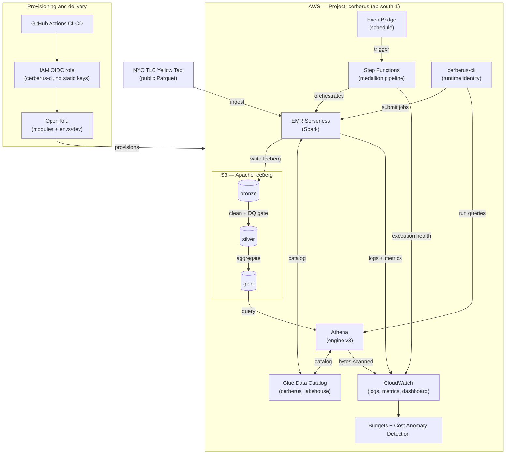
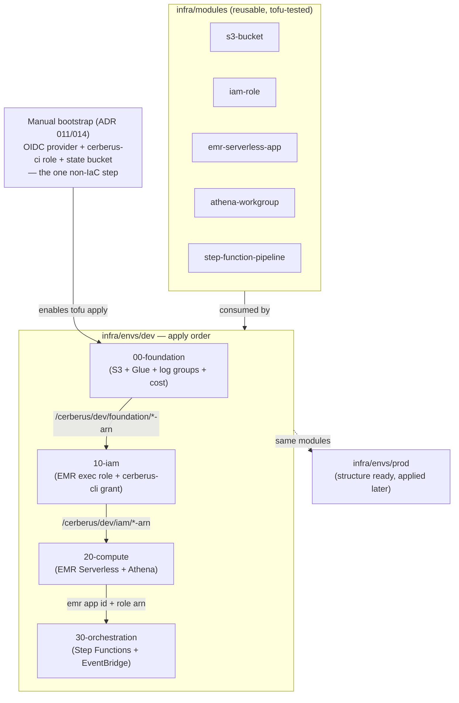

# Cerberus — Architecture

Visual reference for the Cerberus serverless lakehouse, built as a platform-engineering
lab. Three views: the overall platform, the IaC layering, and the CI/CD + orchestration
flow. These diagrams are sourced into the project README.

Companion docs: [`../roadmap.md`](../roadmap.md), [`../platform-plan.md`](../platform-plan.md),
and the decision trail in [`adr/`](adr/).

---

## Diagram A — Overall Platform Architecture

How provisioning, the data plane, orchestration, and observability fit together.

---

## Diagram B — IaC Layering (ADR 012/013)

Reusable modules feed per-environment stacks. Cross-stack values flow through SSM
Parameter Store, never another stack's state file. One manual bootstrap step enables
everything else.

---

## Diagram C — CI/CD and Orchestration Flow (ADR 015/017)

Left: how a change reaches AWS — policy-gated, OIDC-applied. Right: how the medallion
pipeline runs on a schedule with data-quality gates between layers.

```mermaid
flowchart LR
    subgraph cicd["CI-CD pipeline (ADR 015/016)"]
        pr["Pull Request"]
        plan["tofu plan<br/>tflint · trivy · conftest(OPA)"]
        review["Review + approve"]
        merge["Merge to main"]
        apply["tofu apply (dev)<br/>via OIDC role"]
        pr --> plan --> review --> merge --> apply
    end

    subgraph orch["Scheduled orchestration (ADR 017/018)"]
        eb["EventBridge<br/>(schedule)"]
        b["Bronze ingest"]
        dq1["PyDeequ gate"]
        s["Silver build"]
        dq2["PyDeequ gate"]
        g["Gold aggregate"]
        eb --> b --> dq1 --> s --> dq2 --> g
    end

    apply -.->|deploys state machine| eb
```

